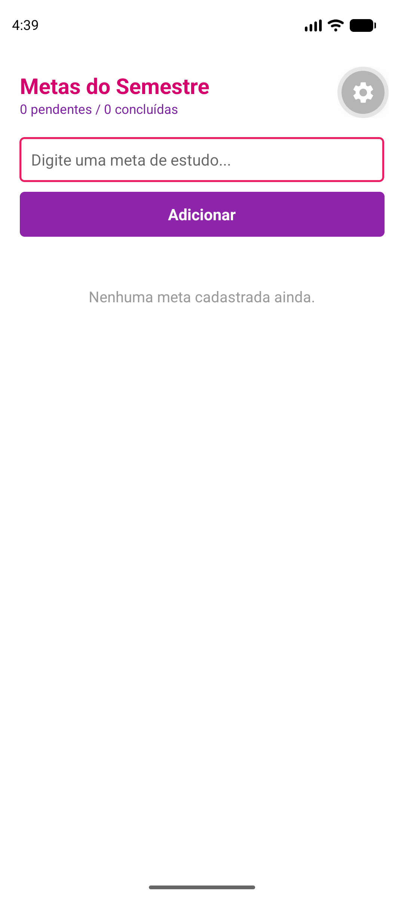
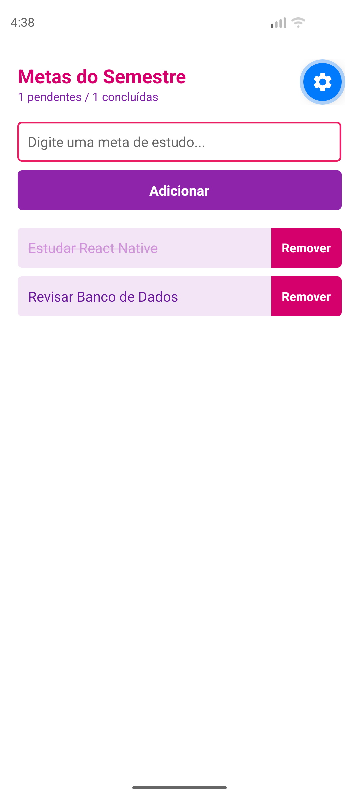
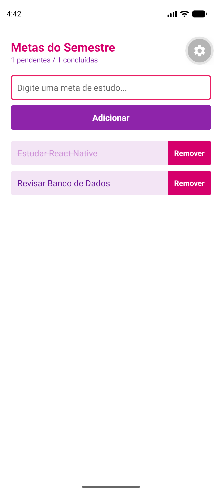

# Metas do Semestre

Atividade da prática 05, disciplina de Programação para Dispositivos Móveis.

É um app pra anotar metas de estudo. Dá pra adicionar, marcar como concluída e
remover. As metas ficam salvas mesmo se fechar o app, usando o AsyncStorage.

## O que o app faz

- Adiciona meta (não deixa adicionar vazio, mostra um Alert)
- Clica na meta pra marcar como concluída (fica com risco no texto)
- Remove meta com o botão "Remover"
- Mostra quantas metas estão pendentes e quantas já foram concluídas
- Salva tudo no celular, então não perde as metas ao fechar o app

## Arquivos

- `App.js` - onde fica o estado principal e a lógica de salvar/carregar
- `components/MetaInput.js` - o campo de texto e o botão de adicionar
- `components/MetaList.js` - a lista das metas

## Sobre o useEffect de carregar e salvar

Os dois estão no App.js.

O primeiro `useEffect` roda só uma vez quando o app abre, e serve pra carregar as
metas que já estavam salvas (usando `AsyncStorage.getItem`).

O segundo `useEffect` fica de olho na lista de metas, e toda vez que ela muda ele
salva de novo (`AsyncStorage.setItem`). Coloquei um `if (carregando) return` nele
porque se não, ele ia salvar um array vazio por cima dos dados antes mesmo do
primeiro useEffect terminar de carregar.

## Como rodar

```
npx expo install
npx expo start
```

Depois é só apertar `a` pra abrir no emulador Android.

## Prints

Lista vazia:



Com metas cadastradas (uma já concluída):



Depois de fechar e abrir o app de novo (mostrando que salvou certinho):



## Desafio extra que fiz

Coloquei a opção de marcar a meta como concluída (clicando nela) e o contador
de pendentes/concluídas no topo.
